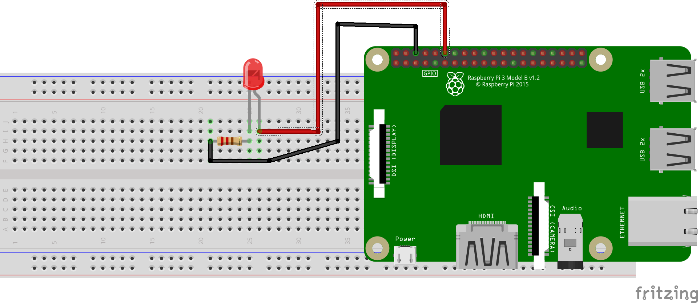
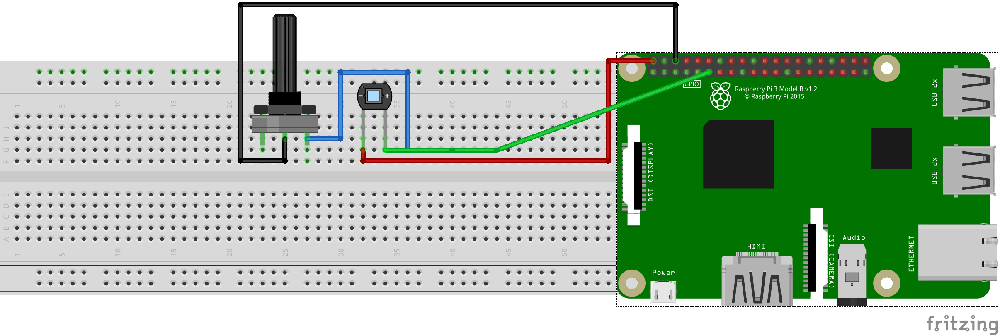
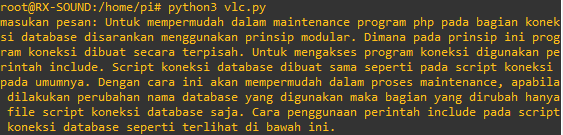
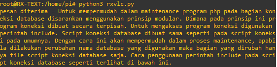

# RaspberryPi-VisibleLightCommunication-Python
 Visibile Light Communication Project with Raspberry Pi and Python programming Language

# Description
 Visible Light Communication is an Optical Communication Project in Politeknik Elektronika Negeri Surabaya (PENS) that using visible light to communicate data from transmitter to receiver. Visible Light are generated by LED and received by PhotoDiode. This Project Are using 2 Raspberry Pi as transmitter and receiver. 

## requirements
Python3
RPi.GPIO


## Circuit
For transmitter:
LED Anode -> GPIO18  
LED Cathode -> Resistor  
Resitor -> GND  



for Receiver:
PD Cathode -> 5V  
PD Anode -> PotentioMeter   
PotentioMeter -> GND  
PD Anode -> GPIO17  


 ## Usage 
 for receiver program
```bash
python3 rxvlc.py
```
for transmitter program
```bash
python3 vlc.py
```
## Result
Transmitter send data:  


Receiver receive the data:  
